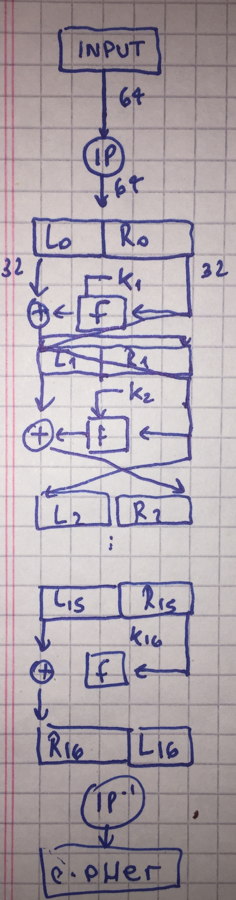
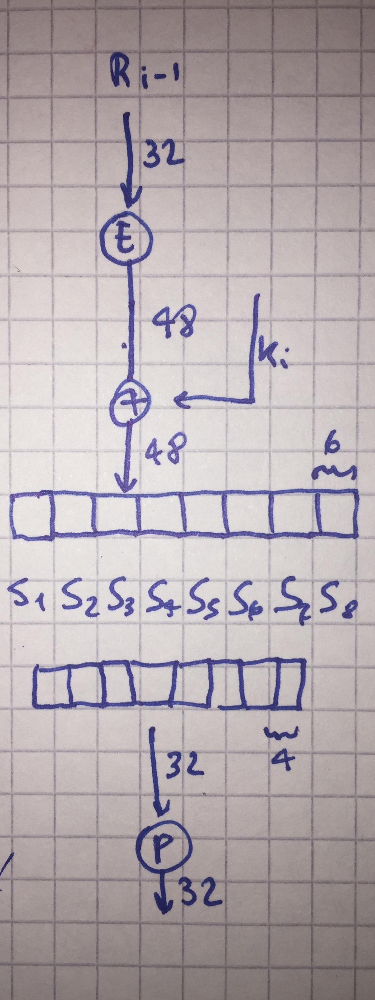
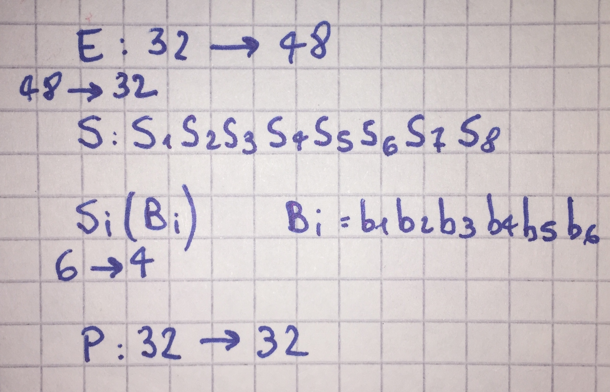

# Descripción del algoritmo DES

El algoritmo está implementado (acá)[DESCrypt.java].

La definición formal es algo así:

El algoritmo busca difundir y confundir los bits y está basado dividido en dos partes.

Primero un proceso de expansión de la clave.

La clave K, de 56 bits efectivos, primero se pasa por una permutación PC1, compuesto de
dos permutaciones PCA y PCB.  La salida de este bloque se pasa por una segunda permutación
PC2 para generar la primer clave '''K1''' de las 16 subclaves que hay que derivar.  Esta
permutación tiene de entrada 56 bits y de salida 48.

El bloque que sale de la primera permutación por otro lado, sufre un shifteo en los bits
que viene dado por la función '''Vi''' (cuantos bits se shiftean según el round).

Esta salida es la entrada para el próximo round donde el proceso se repite hasta alcanzar
los 16 rounds.

El algoritmo principal esta basado en Feistel Boxes:

Son 16 rounds también. El primer paso es aplicar la permutación '''IP''' de 64 a 64
Luego el bloque de 64 se divide en dos de 32, izquierda y derecha.

Del bloque de la derecha se pasa por una función '''F''' y se xorea con la izquierda, para
luego cruzarlos.

Finalmente se pasa por una nueva permutación '''IP''' que es la inversa de la primera.  La desencripción se procede invirtiendo el orden en el que se utilizan las subkeys generadas por la expansión de las claves, lo cual permite ir '''desenroscando''' lo que la encripcion fue armando, todo mediante el mismo exacto algoritmo.

Los parámetros de los algoritmos son las diferentes permutaciones que son fijas y que son quizás el punto más oscuro de DES (¿ de dónde salieron ?).

