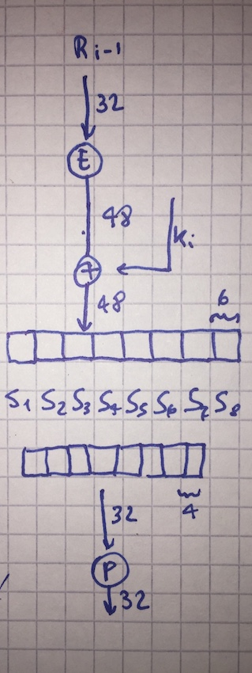

# DEScripción de DES.


El algoritmo está implementado [acá](DESCrypt.java). Se invita al lector a toquetearlo, probarlo, etc. y reportar o contribuir con puntos interesantes (de cara a un objetivo didáctico).

> NOTA: Este código es una implementación didáctica y jamás debe usarse como rutina de encripción simétrica, ya que además de usar un algoritmo que ya está quebrado, la propia implementación no tiene la más mínima rigurosidad.

La definición formal es algo así:


El algoritmo busca difundir y confundir los bits todo lo posible, partiendo del Plaintext
y aplicando rounds repetitivos sobre el mismo para enroscar y enroscar los bits. Aplica operaciones simples como XOR, sustituciones, permutaciones, desplazamientos.  Con esto se arman redes de sustitución y permutación que van combinando los bits.

La clave si bien es de 64 bits, utiliza solo 56 bits ya que un byte entero se usaba en esa epoca para los códigos de redundancia cíclica o checksum.

Los parámetros de los algoritmos son las diferentes permutaciones que son fijas y que son quizás el punto más oscuro de DES.


Las permutaciones son vectores o matrices de igual o distinta longitud que indican los índices de los valores original a utilizar en cada una de las posiciones.  Ejemplo, una permutación [1 2 3] de [3 2 5], da [3 2 5], y una permutación [3 3 1] daría [5 5 3].

# Expansión de la clave

La primer parte es un proceso de expansión de la clave.  Tomando la clave, se derivan un juego de 16 subclaves.


La clave K, de 56 bits efectivos, primero se pasa por una permutación PC1, compuesto de
dos permutaciones PCA y PCB.  

```java
for (int s = 0; s < 28; s++) {
    Cn.set(s, Key.get(PCA[s] - 1));
    Dn.set(s, Key.get(PCB[s] - 1));
}
```

La salida de este bloque se pasa por una segunda permutación
PC2 para generar la primer clave *K1* de las 16 subclaves que hay que derivar.  Esta
permutación tiene de entrada 56 bits y de salida 48:

```java
Bits b1 = new Bits(56);
Bits b2 = new Bits(48);

for (int s = 0; s < 48; s++) {
    b2.set(s, b1.get(PC2[s] - 1));
}
```

El bloque que sale de la primera permutación por otro lado, sufre un shifteo cíclico en los bits que viene dado por la función *Vi* (cuantos bits se shiftean según el índice del round).

```java
for (int d = 0; d <= i; d++) {
    Cn.lshifts(shifts[d]);
    Dn.lshifts(shifts[d]);
}
```

Esta salida es la entrada para el próximo round donde el proceso se repite hasta alcanzar
las 16 repeticiones y así generar las 16 subclaves.

# Feistel Boxes

El algoritmo principal esta basado en Feistel Boxes:


Son 16 rounds también logicamente. El primer paso es aplicar la permutación *IP* de 64 a 64.

```java
// First permutation
for (int j = 0; j < 64; j++) {
    cipher.set(j, plaintext.get(IP[j] - 1));
}
```

Luego el bloque de 64 se divide en dos de 32, izquierda (L) y derecha (R).

```java
// Divide the 64 bits m into two halves.
for (int j = 0; j < 32; j++) {
    L.set(j, cipher.get(j));
    R.set(j, cipher.get(j + 32));
}
La = (Bits) L.clone();
Ra = (Bits) R.clone();
```

Del bloque de la derecha se pasa por una función *F* y se xorea con la izquierda, para
luego intercambiarlos para el próximo round.

```java
// Go for it.  Process each round of Feistel Blocks.
for (int i = 0; i < 16; i++) {
    if (bDecrypt)
        K = KS(15 - i, key);
    else
        K = KS(i, key);
    L.copyFrom(Ra, 32);
    R.copyFrom(La.xor(f(Ra, K)));

    La = (Bits) L.clone();
    Ra = (Bits) R.clone();
}
```

## Función F

Un poco más compleja y hace uso de los S boxes y de las subclaves.



Arranca con el bloque de 32 bits del lado derecho ***Ri-1*** y aplica la permutación E, para luego xorearla con la clave *Ki* que surge del proceso de expansión de la clave, que finalmente se usa como entrada a los S-boxes.


Son 8 matrices de 8x8.  La entrada completa de 48 bits se divide entonces en 8 entradas de 6 bits cada una, y cada entrada es asignada a cada una de las 8 matrices *Si*.

La entrada entonces para cada matriz es *b1.b2.b3.b4.b5.b6* y estos bits se usan para calcular la fila *r* y la columna *c* para indexar la matriz S.  Se accede así a la matriz y la salida son los 4 bits almacenados en esa posición de la matriz: *s1.s2.s3.s4*.

El código lo opera de esta forma:

```java
// Divide the 48 bits block in 8 inputs of 6-bits length each.
for (int i = 0; i < 8; i++) {
    Bits aux = new Bits(6);
    Bits outs = new Bits(4);

    aux.copyFrom(b, i * 6, 6);

    int row = aux.getInt(5) + aux.getInt(0) * 2;
    int col = aux.getInt(4) + aux.getInt(3) * 2 + aux.getInt(2) * 4
            + aux.getInt(1) * 8;

    outs.load(S[i][row * 16 + col]);

    Out.copyFrom(i * 4, outs, 0, 4);
}
```

Como cada matriz *Si* tiene una salida de 4 bits, al juntar y concatenar todos los bits de los 8 se alcanzan los 32 bits que se pasan nuevamente por otra permutación, *P*, y son los que se utilizan para xorear con el lado izquierdo *L*.

## Encripción y Desencripción

Finalmente se pasa por una nueva permutación ***IP*** que es la inversa de la primera.  La desencripción se procede invirtiendo el orden en el que se utilizan las subkeys generadas por la expansión de las claves.

```java
for (int i = 0; i < 16; i++) {
    if (bDecrypt)
        K = KS(15 - i, key);
    else
        K = KS(i, key);
    L.copyFrom(Ra, 32);
    R.copyFrom(La.xor(f(Ra, K)));

    La = (Bits) L.clone();
    Ra = (Bits) R.clone();
}
```
El único cambio entre la encripción y la desencripción es justamente que se invierte el orden de las subclaves.  Esto permite ir desenroscando lo que la encripcion fue armando, todo mediante el mismo exacto algoritmo.

# Referencias

* Menezes, Capítulo 7.
* [Defunct Mapplesoft DES description](https://www.maplesoft.com/applications/index.aspx/powertools/cryptography/HTML/DES-Example.html)
