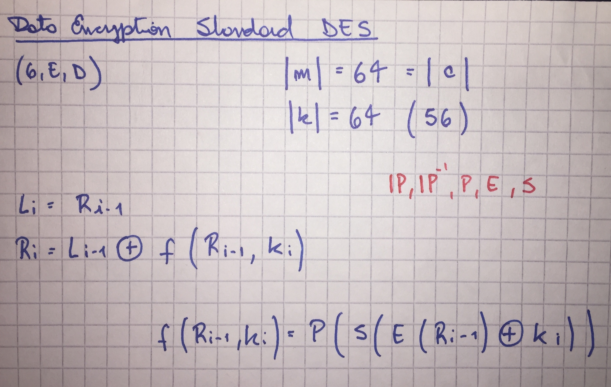
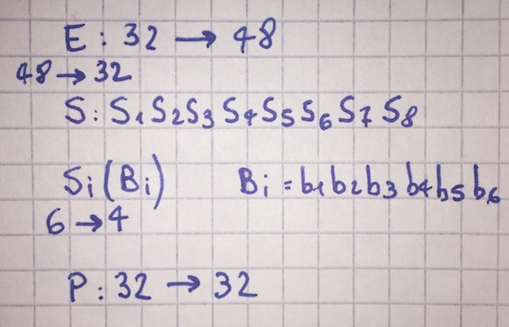
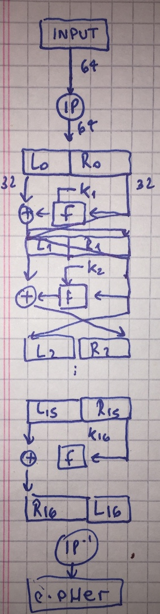

# Descripción del algoritmo DES

El algoritmo está implementado !(acá)[DESCrypt.java].

La definición formal es algo así:

El algoritmo busca difundir y confundir los bits todo lo posible, partiendo del Plaintext
y aplicando rounds repetitivos sobre el mismo para enroscar y enroscar los bits.

La clave si bien es de 64 bits, utiliza solo 56 bits ya que un byte entero se usaba en esa epoca para los códigos de redundancia cíclica (el almacenamiento no era tan reliable como hoy en día).

Los parámetros de los algoritmos son las diferentes permutaciones que son fijas y que son quizás el punto más oscuro de DES.

Las permutaciones son vectores o matrices de igual o distinta longitud que indican los índices de los valores original a utilizar en cada una de las posiciones.  Ejemplo, una permutación [1 2 3] de [3 2 5], da [3 2 5], y una permutación [3 3 1] daría [5 5 3].

# Expansión de la clave

La primer parte es un proceso de expansión de la clave.  Tomando la clave, se derivan un juego de 16 subclaves.

La clave K, de 56 bits efectivos, primero se pasa por una permutación PC1, compuesto de
dos permutaciones PCA y PCB.  La salida de este bloque se pasa por una segunda permutación
PC2 para generar la primer clave '''K1''' de las 16 subclaves que hay que derivar.  Esta
permutación tiene de entrada 56 bits y de salida 48.

El bloque que sale de la primera permutación por otro lado, sufre un shifteo en los bits
que viene dado por la función '''Vi''' (cuantos bits se shiftean según el índice del round).

Esta salida es la entrada para el próximo round donde el proceso se repite hasta alcanzar
los 16.

# Feistel Boxes

El algoritmo principal esta basado en Feistel Boxes:

Son 16 rounds también logicamente. El primer paso es aplicar la permutación '''IP''' de 64 a 64. Luego el bloque de 64 se divide en dos de 32, izquierda (L) y derecha (R).

Del bloque de la derecha se pasa por una función '''F''' y se xorea con la izquierda, para
luego intercambiarlos para el próximo round.

## Función F

La función S es un poco más compleja y hace uso de los S boxes y de las subclaves.

Finalmente se pasa por una nueva permutación '''IP''' que es la inversa de la primera.  La desencripción se procede invirtiendo el orden en el que se utilizan las subkeys generadas por la expansión de las claves, lo cual permite ir '''desenroscando''' lo que la encripcion fue armando, todo mediante el mismo exacto algoritmo.
